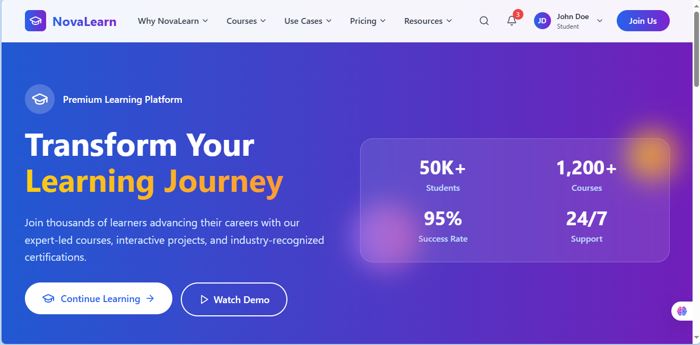
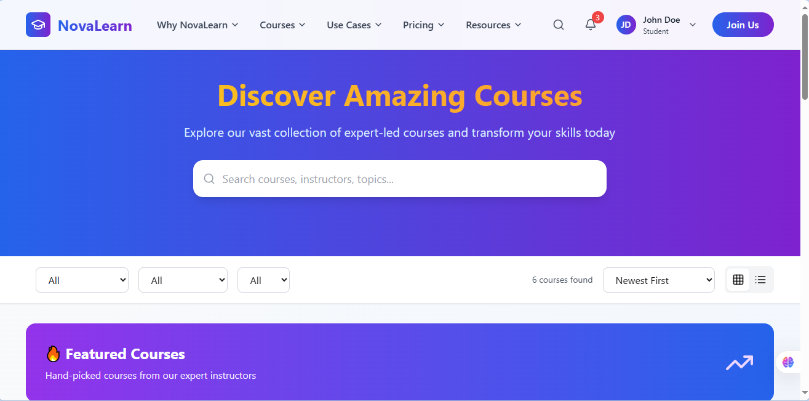

# 🚀 NovaLearn - Advanced Learning Management System

<div align="center">
  
  
  
  
  
  
</div>

<div align="center">
  <h3>🎓 Empowering Education Through Technology</h3>
  <p><em>A comprehensive, full-stack Learning Management System built with modern web technologies</em></p>
</div>

---

## 📋 Table of Contents

- [🌟 Overview](#-overview)
- [✨ Key Features](#-key-features)
- [🛠️ Tech Stack](#️-tech-stack)
- [🏗️ Architecture](#️-architecture)
- [🚀 Quick Start](#-quick-start)
- [📱 User Roles & Permissions](#-user-roles--permissions)
- [🎯 Core Functionalities](#-core-functionalities)
- [📊 Analytics & Reporting](#-analytics--reporting)
- [🔐 Security Features](#-security-features)
- [📸 Screenshots](#-screenshots)
- [🌐 Live Demo](#-live-demo)
- [🤝 Contributing](#-contributing)
- [📄 License](#-license)

---

## 🌟 Overview

**NovaLearn** is a cutting-edge Learning Management System designed to revolutionize online education. Built with the powerful MERN stack, it provides a seamless, intuitive platform that connects students, instructors, and administrators in a unified educational ecosystem.

### 🎯 Mission
To democratize quality education by providing robust tools for course creation, student engagement, and learning analytics - all wrapped in a beautiful, responsive interface.

---

## ✨ Key Features

### 🔐 **Authentication & Security**
- **JWT-based Authentication** with secure token management
- **Role-based Access Control** (Admin | Instructor | Student)
- **Password encryption** using bcrypt
- **Protected routes** and API endpoints

### 📚 **Course Management**
- **Interactive Course Creation** with rich content editor
- **Video Lecture Integration** with progress tracking
- **Assignment Management** with submission & grading system
- **Course Enrollment** with automatic progress tracking
- **Discussion Boards** for collaborative learning

### 👥 **User Experience**
- **Personalized Dashboards** for each user role
- **Real-time Notifications** and updates
- **Progress Analytics** and performance insights
- **Responsive Design** for all devices
- **Search & Filter** functionality

### 📊 **Advanced Analytics**
- **Learning Progress Tracking**
- **Course Performance Metrics**
- **User Engagement Analytics**
- **Revenue & Enrollment Reports**

### ☁️ **Cloud Integration**
- **Secure File Uploads** to cloud storage
- **Video Streaming** optimization
- **Scalable Database** with MongoDB Atlas
- **CDN Integration** for fast content delivery

---

## 🛠️ Tech Stack

### **Frontend**
```javascript
// Core Technologies
React.js 18+          // Modern UI library with hooks
Redux Toolkit         // State management
Tailwind CSS         // Utility-first CSS framework
React Router         // Client-side routing
Axios               // HTTP client for API calls
```

### **Backend**
```javascript
// Server Technologies
Node.js             // Runtime environment
Express.js          // Web application framework
MongoDB             // NoSQL database
Mongoose            // MongoDB object modeling
JWT                 // JSON Web Tokens for auth
Multer              // File upload handling
```

### **Deployment & Cloud**
```bash
# Deployment Platforms
Frontend: Netlify     # Static site deployment
Database: MongoDB Atlas # Cloud database service
Storage: Cloudinary   # Media management
```

---

## 🏗️ Architecture

```
┌─────────────────┐    ┌─────────────────┐    ┌─────────────────┐
│   React Client  │    │  Express API    │    │   MongoDB       │
│                 │    │                 │    │                 │
│ • Redux Store   │◄──►│ • RESTful APIs  │◄──►│ • User Data     │
│ • Components    │    │ • Middleware    │    │ • Course Data   │
│ • Routing       │    │ • Authentication│    │ • Analytics     │
└─────────────────┘    └─────────────────┘    └─────────────────┘
         │                       │                       │
         ▼                       ▼                       ▼
┌─────────────────┐    ┌─────────────────┐    ┌─────────────────┐
│   Netlify       │    │   JWT Security  │    │  MongoDB Atlas  │
│   Deployment    │    │   & Validation  │    │  Cloud Database │
└─────────────────┘    └─────────────────┘    └─────────────────┘
```

---

## 🚀 Quick Start

### Prerequisites
```bash
node >= 14.x
npm >= 6.x
git
```

### Installation

1. **Clone the Repository**
```bash
git clone https://github.com/yourusername/novallearn.git
cd novallearn
```

2. **Install Dependencies**
```bash
# Install backend dependencies
cd backend
npm install

# Install frontend dependencies
cd ../frontend
npm install
```

3. **Environment Configuration**
```bash
# Backend (.env)
MONGODB_URI=your_mongodb_connection_string
JWT_SECRET=your_jwt_secret_key
CLOUDINARY_CLOUD_NAME=your_cloudinary_name
CLOUDINARY_API_KEY=your_cloudinary_key
CLOUDINARY_API_SECRET=your_cloudinary_secret
PORT=5000

# Frontend (.env)
REACT_APP_API_URL=http://localhost:5000/api
REACT_APP_CLOUDINARY_UPLOAD_PRESET=your_upload_preset
```

4. **Run the Application**
```bash
# Start backend server
cd backend
npm run dev

# Start frontend development server
cd frontend
npm start
```

5. **Access the Application**
- Frontend: `http://localhost:3000`
- Backend API: `http://localhost:5000`

---

## 📱 User Roles & Permissions

### 👨‍💼 **Admin**
- ✅ Full system access and management
- ✅ User management (create, update, delete)
- ✅ Course approval and moderation
- ✅ Platform analytics and reports
- ✅ System configuration

### 👨‍🏫 **Instructor**
- ✅ Course creation and management
- ✅ Student enrollment management
- ✅ Assignment creation and grading
- ✅ Discussion board moderation
- ✅ Course analytics and insights

### 👨‍🎓 **Student**
- ✅ Course enrollment and access
- ✅ Video lecture viewing
- ✅ Assignment submission
- ✅ Discussion participation
- ✅ Progress tracking

---

## 🎯 Core Functionalities

### 📖 **Course Management**
```javascript
// Course Creation Flow
Create Course → Add Modules → Upload Content → Set Pricing → Publish
```

### 🎥 **Video Learning**
- Seamless video streaming with progress tracking
- Playback speed control and quality adjustment
- Automatic resume functionality
- Chapter-based navigation

### 📝 **Assignment System**
- Rich text editor for assignment creation
- File upload support for submissions
- Automated grading with manual override
- Deadline management with notifications

### 💬 **Discussion Boards**
- Threaded discussions for better organization
- Real-time messaging capabilities
- Instructor moderation tools
- Search and filter functionality

---

## 📊 Analytics & Reporting

### **Student Analytics**
- Course completion rates
- Time spent on learning
- Assignment performance
- Learning streak tracking

### **Instructor Analytics**
- Course engagement metrics
- Student progress overview
- Revenue and enrollment stats
- Popular content identification

### **Admin Analytics**
- Platform-wide usage statistics
- User growth and retention
- Course performance comparison
- System health monitoring

---

## 🔐 Security Features

### **Authentication Security**
- JWT token-based authentication
- Secure password hashing with bcrypt
- Token refresh mechanism
- Session timeout management

### **Data Protection**
- Input validation and sanitization
- SQL injection prevention
- XSS attack protection
- CORS configuration

### **API Security**
- Rate limiting implementation
- Request size limitations
- Secure headers configuration
- Environment variable protection

---

## 📸 Screenshots

### Dashboard Overview


### Course Interface


### Mobile Responsive


---

## 🌐 Live Demo

🔗 **[View Live Demo](https://nova-learn-lms-nadeeshamedagama.netlify.app/)**

### Demo Credentials
```
Admin:
Email: admin@novallearn.com
Password: admin123

Instructor:
Email: instructor@novallearn.com
Password: instructor123

Student:
Email: student@novallearn.com
Password: student123
```

---

## 📁 Project Structure

```
novallearn/
├── frontend/
│   ├── public/
│   ├── src/
│   │   ├── components/
│   │   │   ├── common/
│   │   │   ├── courses/
│   │   │   ├── dashboard/
│   │   │   └── auth/
│   │   ├── pages/
│   │   ├── redux/
│   │   │   ├── slices/
│   │   │   └── store.js
│   │   ├── utils/
│   │   └── App.js
│   └── package.json
├── backend/
│   ├── controllers/
│   ├── models/
│   ├── routes/
│   ├── middleware/
│   ├── utils/
│   └── server.js
├── README.md
└── package.json
```

---

## 🔧 API Documentation

### **Authentication Endpoints**
```javascript
POST /api/auth/register    // User registration
POST /api/auth/login       // User login
POST /api/auth/logout      // User logout
GET  /api/auth/profile     // Get user profile
```

### **Course Endpoints**
```javascript
GET    /api/courses        // Get all courses
POST   /api/courses        // Create new course
GET    /api/courses/:id    // Get specific course
PUT    /api/courses/:id    // Update course
DELETE /api/courses/:id    // Delete course
```

### **User Management**
```javascript
GET    /api/users          // Get all users (Admin only)
PUT    /api/users/:id      // Update user
DELETE /api/users/:id      // Delete user (Admin only)
```

---

## 🚀 Deployment

### **Frontend Deployment (Netlify)**
```bash
# Build the project
npm run build

# Deploy to Netlify
# Upload build folder or connect GitHub repository
```

### **Backend Deployment**
```bash
# Environment variables setup
# Deploy to your preferred hosting service
# Update CORS settings for production
```

---

## 🛠️ Development Guidelines

### **Code Style**
- Use ESLint and Prettier for consistent formatting
- Follow React best practices and hooks guidelines
- Implement proper error handling
- Write meaningful commit messages

### **Testing**
```bash
# Run frontend tests
npm test

# Run backend tests
npm run test:backend
```

---

## 🤝 Contributing

We welcome contributions! Please follow these steps:

1. **Fork the repository**
2. **Create a feature branch** (`git checkout -b feature/AmazingFeature`)
3. **Commit your changes** (`git commit -m 'Add some AmazingFeature'`)
4. **Push to the branch** (`git push origin feature/AmazingFeature`)
5. **Open a Pull Request**

### **Contribution Guidelines**
- Follow the existing code style
- Add tests for new features
- Update documentation as needed
- Ensure all tests pass before submitting

---

## 📞 Support & Contact

- **Email**: support@novallearn.com
- **GitHub Issues**: [Report a Bug](https://github.com/NadeeshaMedagama/LMS_platform_with_MERN_stack.git/issues)
- **Documentation**: [Full Documentation](https://nova-learn-lms-nadeeshamedagama.netlify.app/)

---

## 📄 License

This project is licensed under the MIT License - see the [LICENSE](LICENSE) file for details.

---

## 🙏 Acknowledgments

- **React Team** for the amazing framework
- **MongoDB** for the flexible database solution
- **Tailwind CSS** for the utility-first approach
- **Open Source Community** for inspiration and support

---

<div align="center">
  <h3>⭐ Star this repository if you found it helpful!</h3>
  <p>Made with ❤️ by Nadeesha Medagama</p>

  <a href="https://github.com/NadeeshaMedagama/LMS_platform_with_MERN_stack.git">
    
  </a>
  <a href="https://github.com/NadeeshaMedagama/LMS_platform_with_MERN_stack.git">
    
  </a>
</div>

---

*Built with passion for education and modern web technologies* 🚀
